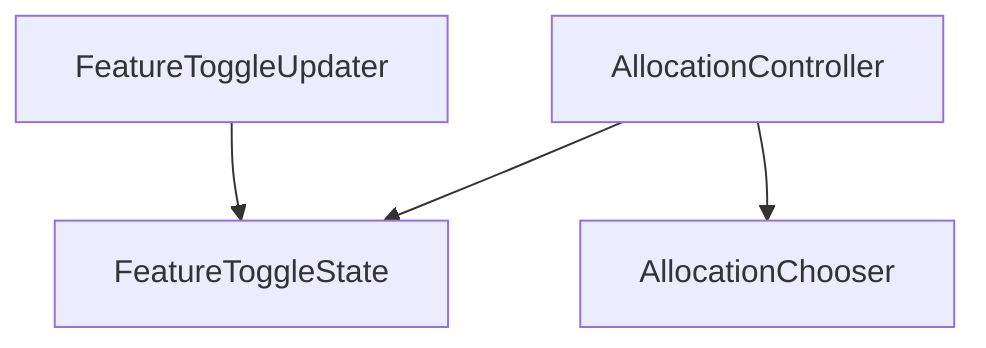
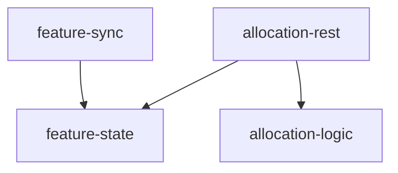
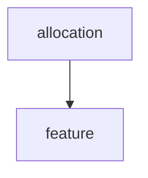

# Technical Practices for Agile Development

Alex Bepple  
Last update: 10 June 2022

[TOC]


## Trunk-Based Development

There may be good use cases for feature branches. Software development in a collaborative team that’s limiting its work in progress is not it.

Major drawbacks of feature branches:

* Risk of merge conflicts.
* Different branches cannot be effectively continuously integrated. Risk of semantic merge conflicts that go undetected.
* Delayed release into the wild increases risk of late regressions.
* Fear of merge conflicts reduces willingness to refactor.

The solution: [Trunk-Based Development](https://trunkbaseddevelopment.com/) using [Feature Toggles](https://martinfowler.com/articles/feature-toggles.html).


## Test-Driven Development

Core loop: <span style="color:red">Red</span> → <span style="color:green">Green</span> → <span style="color:blue">Refactor</span>.  
Do not forget _refactoring!_

Seeing a test <span style="color:red">fail</span> is essential. It ensures that you are testing what you think you are testing. You may have written a dead test, a tautological test, executed the wrong thing, etc. (If you happen to write a test _after_ the implementation, do yourself a favor: break the code and see the test fail.)

Test-Driven Development is not a testing approach. TDD is a technique for structuring your development flow. It guides you to implement a big thing bit by bit and to never doubt whether the small bit that you implemented first still works. 

TDD can be applied at different levels: from micro tests ("unit tests", "narrow tests") to end-to-end tests. The length of the feedback loop varies accordingly. At the micro level, it takes minutes at the most. The larger the test scope, i.e. the unit under test, the longer. At e2e level, it might take days. However, whenever possible, prefer smaller slices of functionality. Even at e2e level, try sticking to sub-day granularity.

### Micro Patterns

_Obvious implementation_  
When bar is <span style="color:red">red</span>, just write the <span style="color:green">correct</span> implementation, if you can do it in timely fashion.

_Fake it till you make it_  
When <span style="color:red">red</span>, quickly get to <span style="color:green">green</span> using a fake, continue engineering the proper implementation by slowly reverse-engeineering the fake, while staying <span style="color:green">green</span>.  
Take a look at [Wikipedia article](https://en.wikipedia.org/wiki/Fake_it_till_you_make_it) for interesting cultural references.

_Triangulation_   
Start when <span style="color:green">green</span>. Add another <span style="color:red">red</span> test in order to force your code to move in the direction of the desired behavior.

Rock climber metaphor … When you are doing something easy and you are having a great day, nothing wrong with _obvious implementation._ The less certain you are, the more safety you can give yourself with either _fake it till you make it_ or _triangulation._


## Refactoring

> to refactor _(vt, vi)_ 
> improve structure of code without changing observable behavior

Purpose of improvement: ease maintenance.  
Vectors of attack: 

* make code easier to understand, e.g. improve names, hide incidental details
* make code easier to modify, e.g. establish technical properties such as immutability, remove duplication

Of course, it depends on the point of view what is "observable" behavior and what isn’t. Your automated test suite should represent most of the behavior that you consider "observable" and intentional. When writing tests – esp. after the fact – beware of tests that specify _incidental_ behavior.

Term [popularized](https://martinfowler.com/books/refactoring.html) by Martin Fowler.

If you want inspiration for how to refactor legacy code, Michael Feathers’ «[Working Effectively with Legacy Code](https://www.goodreads.com/en/book/show/44919.Working_Effectively_with_Legacy_Code)» is a classic.


## Automated Testing

### FIRST

Good automated tests are FIRST.

* Fast  
  For micro tests a workable rule of thumb: <1 ms per test. Reasoning: a healthy-sized code base can have a couple of thousands of micro tests. These should be able to run within a few seconds.
* Isolated
* Repeatable  
  This becomes a particular challenge with increasing test scope. Indirect external inputs in particular love to be sources of flakiness. Typical examples: system clock, external services. With test scope, technology-induced flakiness increases, too. Very common pain point: asynchronicity in browser.  
  Remedy: prefer micro tests of pure functions whenever possible. Also see warning against too large test scopes.
* Self-verifying
* Timely

### Strategy for Test Suites

Classic recommendation and still a good rule of thumb: Testing Pyramid. 
Good overview and discussion: https://martinfowler.com/articles/practical-test-pyramid.html

#### Warning 1: Beware of Too Integrative Attitude

It is all too common. For instance:

> The more your tests resemble the way your software is used,
> the more confidence they can give you.
>
> – Kent C. Dodds, https://testing-library.com/

He is not wrong. But this is only one side of the truth. There are huge downsides to this approach: low speed of execution, low failure locality, technical complexity, setup complexity.

Solution: overlapping sociable tests (cp. discussion of Testing Pyramid linked above).

Recommendation: push every worthwhile observable behavior as far as possible to the micro level – as long as it’s sensible – and test it there. This approach has the additional benefit of driving your technical design. Remember `formatRate` in our example code base.

#### Warning 2: Test Doubles Everywhere

Mocks and stubs have the nasty habit of making tests hard to understand. Because of their technical focus, they also tend to cement design choices, achieving the opposite of what tests were supposed to do: support engineers when changing software.

Steve Freeman and Nat Pryce’s «[Growing Object-Oriented Software Guided by Tests](http://www.growing-object-oriented-software.com/)» was the high point of test doubles and also demonstrated the flaws of the approach.

James Shore’s «[Testing without Mocks](https://www.jamesshore.com/v2/blog/2018/testing-without-mocks)» is an eye opener for patterns for overlapping sociable tests that strike a balance between small test scope and remaining easy to understand. E.g. [Logic Sandwich](https://www.jamesshore.com/v2/blog/2018/testing-without-mocks#logic-sandwich) cleanly separates infrastructure interactions from logic. All logic becomes easily micro-testable.

### Testing Quadrants

An adjacent and broader way for thinking about testing in agile development are the Testing Quadrants.

Originally suggested [by Brian Marick](http://www.exampler.com/old-blog/2003/08/21/#agile-testing-project-1) in 2003. Popularized by Lisa Crispin and Janet Gregory in «[Agile Testing](https://www.goodreads.com/book/show/5341009-agile-testing)» (cp. [summary](https://lisacrispin.com/2011/11/08/using-the-agile-testing-quadrants/)). Gojko Adjic [puts](https://gojko.net/2013/10/21/lets-break-the-agile-testing-quadrants/) a nice spin on the original by distinguishing between "checking for expected outputs" and "analysing undefined, unknown and unexpected".


## The Smell of Duplication

Of the many [code smells](https://en.wikipedia.org/wiki/Code_smell), which we eliminate by refactoring, my favorite by far is duplication. It is deceptively simple, yet consequential.

1. Duplication, over time, leads to subtle differences in behavior between different parts of the system.
2. Duplication can make a system harder to understand because from reading code alone it is not obvious that something is supposed to be the same as something else. This compounds; it becomes harder and harder to see the forest for the trees.

Conversely, removing duplication ([DRY](https://en.wikipedia.org/wiki/Don%27t_repeat_yourself)-ing) drives technical design. When we remove duplication, we create a new code unit which we need to name and to place. This requires us to better understand our system. – We have to thank Kent Beck, J.B. Rainsberger and Martin Fowler for [advancing our understanding](https://martinfowler.com/bliki/BeckDesignRules.html) of this interplay between removing duplication and revealing intent.

However, remember that

> duplication is far cheaper than the wrong abstraction
>
> – Sandi Metz, https://sandimetz.com/blog/2016/1/20/the-wrong-abstraction

The rule of three is a good rule of thumb. If the abstraction is not crystal clear from two occurrences, wait for the third. In the meantime, keep duplications as close to each other as possible.


## Software Architecture

Why talk about software architecture at all? Ensure long-term maintainability of a system. This can be broken down into at least two parts:

1. It would be great, if we could limit the frequency of rude comments from successive maintainers when they try to understand what the system does _and why._
2. A good architecture restricts choices and supports decision making while developing software.

But let’s start with the elements.

### Low Coupling, High Cohesion – The Holy Grail


Source: https://en.wikipedia.org/wiki/Coupling_(computer_programming)

The notions of coupling & cohesion are intertwined.

> Cohesion—the principle that “things that belong together should be kept together”—makes code easier to understand, debug, and test.
>
> – Tim Ottinger, Jeff Langr. https://web.archive.org/web/20160702072107/https://pragprog.com/magazines/2010-12/cohesive-software-design ([PDF](https://langrsoft.com/ftp/pragpub-2010-12.pdf))

> The key question is: How much of one module must be known in order to understand another module? _The more that we must know of module B in order to understand module A, the more closely connected A is to B._ [emphasis preserved] // […] Obviously, what we are striving for is loosely coupled systems – that is, systems in which one can _study (or debug, or maintain)_ [emphasis added] any one module without having to know very much about any other modules in the system. // […] If two modules are highly coupled, then there is a high probability that a programmer trying to modify one of them will have to make a change to the other. Clearly _total systems cost_ [emphasis added] will be strongly influenced by the degree of coupling between modules.
>
> – Yourdon, Constantine, 1979. Structured Design. Fundamentals of a Discipline of Computer Program and Systems Design. p 85

### Dependency-Inversion Principle

My favorite design principle to foster cohesion and reduce coupling is the DIP.

> High Level Modules Should Not Depend Upon Low Level Modules.  
> Both Should Depend Upon Abstractions.
>
> Abstractions Should Not Depend Upon Details.  
> Details Should Depend Upon Abstractions.
>
> – Robert C. Martin

* [Original article](https://arweave.net/7CBm9EIGSzNZdiVZNJpXEXx79CI9MOPQP-RBkkLmYrE)
* [Very good discussion by Brett Schuchert](https://martinfowler.com/articles/dipInTheWild.html)

There are many ways to implement the DIP, including 

* [Observer design pattern](https://sourcemaking.com/design_patterns/observer)  
  (remember decoupling error handling in `bestFetchEver` from Redux)
* Dependency Injection

Beware: neither dependency injection, nor any other technical facility implies that the _principle_ of dependency inversion is followed.

### Dependency-Inverted Architecture

The Dependency-Inversion Principle is great design principle and a great guiding principle for achitecture. Its applications to full-blown architectures are known as

* [Hexagonal Architecture](https://en.wikipedia.org/wiki/Hexagonal_architecture_(software)) (aka "Ports and Adapters")
* [Clean Architecture](https://blog.cleancoder.com/uncle-bob/2012/08/13/the-clean-architecture.html)
* and many others

Despite the conceptual elegance, these architectures, when followed strictly, make you pay a huge cognitive tax because they make even simple things complicated.

Remember this?



Or, at module level:



Not only does the cognitive complexity explode for a non-trivial system. In my experience, oftentimes, following this architectural style blindly actually increases coupling. For instance, `AllocationController` and `AllocationChooser` are likely to change in tandem as our domain evolves. If that’s the case, spreading these two out over two modules only creates friction without any tangible benefits.

Instead, I suggest to only invert when needed and to keep things simple until then:



When is then? In this particular example: when incidental details of external APIs or details of updating feature state creep into `allocation`.

I understand that this approach is more complex than a hard rule and requires one to take more care when developing. But in my view this at least allows for a clean architecture without quickly becoming impractical. – This also ties in nicely with something that I have learned from Kent Beck: cohesion and coupling are hard to analyze statically, but are better understood dynamically, i.e. by observing how a system evolves, which change it must support. (Unfortunately I do not have a citation for this.) Put differently: what looks like a fabulously bad choice may not matter in the longer term, if you never have to touch this piece of code. Put effort into more elaborate architecture where it actually matters: where you stumble upon deficiencies of previous architectural choices.


## Bonus

### Generative Testing – Complement to Example-Based Testing

aka property-based testing
Invented by John Hughes: [QuickCheck](https://en.wikipedia.org/wiki/QuickCheck) (Haskell)

> Property based testing is the construction of tests such that, when these tests are fuzzed, failures in the test reveal problems with the system under test.
>
> – David R. MacIver, https://hypothesis.works/articles/what-is-property-based-testing/

Collection of ressources on generative testing: https://jqwik.net/property-based-testing.html

Example tools:

* [jqwik](https://jqwik.net/) (Java)
* [JSVerify](https://jsverify.github.io/) (JavaScript)


### Mutation Testing – Obscure, Conceptually Fascinating Technique

> Bugs, or *mutants*, are automatically inserted into your production code. Your tests are run for each mutant. If your tests *fail* then the mutant is *killed*. If your tests passed, the mutant *survived*. The higher the percentage of mutants killed, the more *effective* your tests are.
>
> – https://stryker-mutator.io/docs/

Example tools:

* [PIT](http://pitest.org/) (Java)
* [Stryker](https://stryker-mutator.github.io/) (JavaScript)


### Penetration Testing

["How to Learn Penetration Testing: A Beginners Tutorial"](https://dev.to/ctrlshifti/how-to-learn-penetration-testing-a-beginners-tutorial-505a)


### Composed Method Pattern

> Divide your program into methods that perform one identifiable task. Keep all of the operations in a method at the same level of abstraction. This will naturally result in programs with many small methods, each a few lines long.
>
> When you use ExtractMethod a bunch of times on a method the original method becomes a ComposedMethod.
>
> – Kent Beck, https://wiki.c2.com/?ComposedMethod

Of course, this applies not only to operations. For instance, compare this React component …

```javascript
<>
  <div data-testid="allocation-c020b901">
    <Card>
      Best rate: {bestAllocation.rate && bestAllocation.rate.toFixed(2)}% ({bestAllocation.name})
    </Card>
  </div>
  {features[FEATURES.MULTIPLE_TIERS] === "on"
    ? <div className="pt-2">
        <Card>
          <InputWithLabel {...} />
          <div className="pt-4"><AllocationsTable allocations={allocations}/></div>
        </Card>
      </div>
    : null
  }
  <div className="pt-2">
    <Card>
      <p>WAGMI</p>
    </Card>
  </div>
</>
```

to this …

```javascript
<>
  <Card><BestRateInfo/></Card>
  {features[FEATURES.MULTIPLE_TIERS] === "on"
    ? <div className="pt-2">
        <Card><AllocationsCalculator/></Card>
      </div>
    : null
  }
  <div className="pt-2">
    <InfoCard/>
  </div>
</>
```

## Fun Bits

### Exploratory Testing

Bach brothers demonstrating Exploratory Testing with the Easy button.  
https://youtu.be/Vy0I2SB5OLo

### Yak Shaving

Example usage: «I wasted hours shaving yaks.»

Goes back to Seth Godin: [Don’t shave that yak!](http://sethgodin.typepad.com/seths_blog/2005/03/dont_shave_that.html) 

